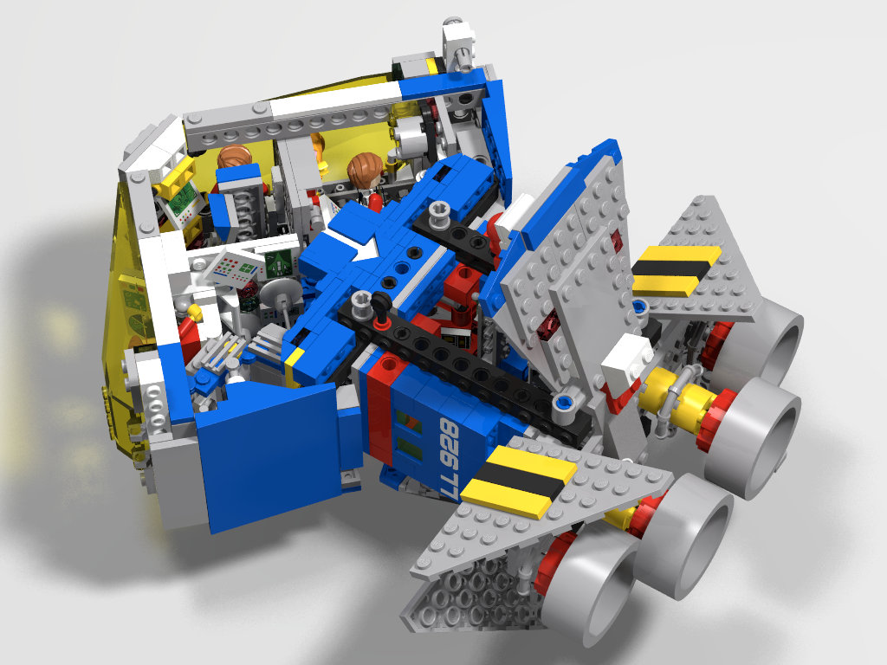
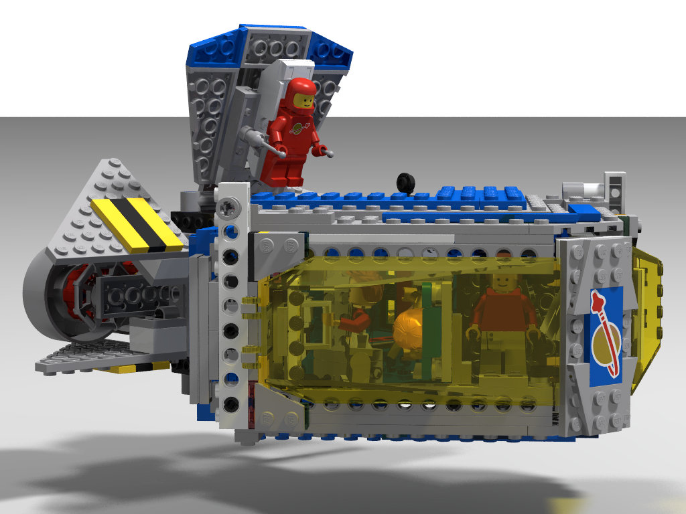
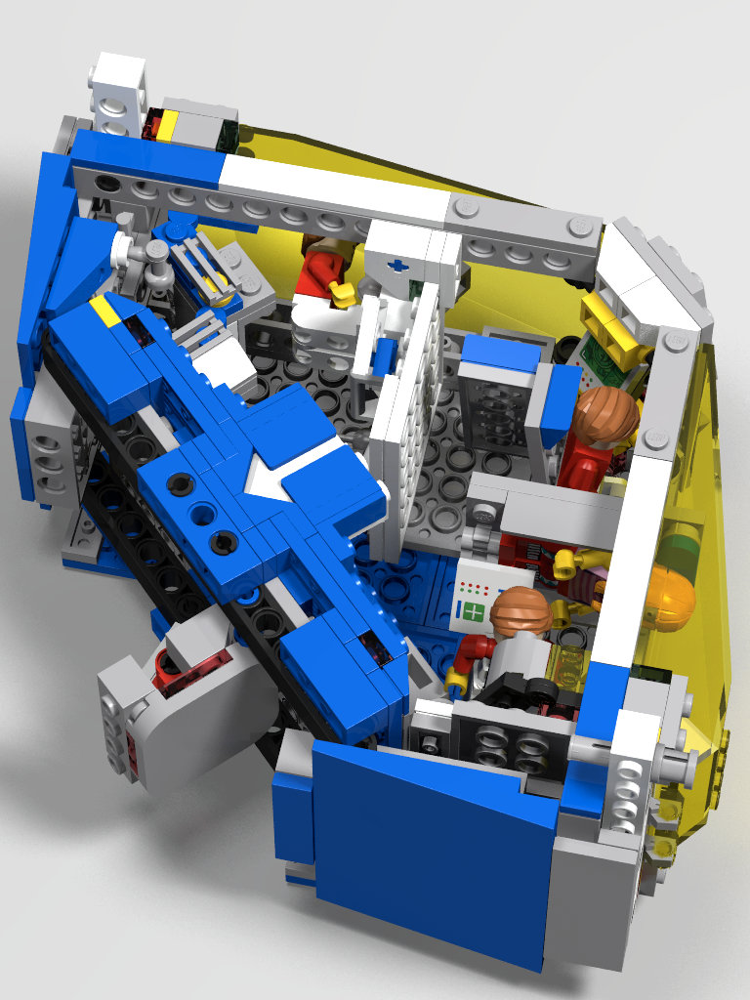

# (MOC) Stingray: Deep space explorer. (Very) Alternate build for 10497

Affectionately nicknamed "Ol' Bug Eyes" by some and "The Brick Arrow" by others,
the Stingray DSE-4 (MK I) is Bengal Shipyards' workhorse Deep Space Explorer.
Several have been used to explore the Oort cloud for water and rare earths
mining opportunities. 

## Play features

1. Spacious main cabin with bridge, medibay, sleeping bays and workstations.
   Plenty of space for its four-person crew.
1. Removable top hull for easy accessibility to main cabin.
1. Cargo bay with large swing out doors that house and launch jetpacks.
1. Two jetpacks for closeup comet, asteroid, and ice cluster exploration.
1. Air-lock separates shirt sleeves main cabin environment from cargo bay.
1. Main cabin (Child) can separate from cargo bay + engine module (Mother) and
   function independently for shorter missions requiring more maneuverability.

## Homages to 10497

1. I retained the innovative brick built arrow, which now points where the
   action is (the cargo bay doors and the craft docking line).
2. I transformed the "beds" into jetpacks because I think jetpacks that
   accommodate the astronaut's life support packs are way cooler than beds.
3. More meta than homage, I embraced the "brick built arrow" theme and made the
   whole spaceship look like an arrow. Calling it "The Brick Arrow," however,
   would have been a bit much.

## Potential weak points of the model

1. There are small gaps everywhere, especially the holes from the technic beams
   in the front of the main cabin. I think the model is very playable and
   displayable, so I didn't worry too much that it's not "airtight".
1. Exposed technic beams. I rather like this aesthetic - my favorite themes are
   space and technic, and this set has a lot of both, so I like that we can see
   both very prominently in the Stingray.

### Could the model be bigger?

This design doesn't use all the panels available in 10497. I had a design 
([Conical form](Old/iteration5.io)) that used all the panels and had a lot of
habitable space, but it looked a bit boring (see build diary below for
pictures).

## Why?

Of course at some level this question does not need to be asked: LEGO
blocks invite everyone to use their imagination to make their own creations. 

I bought this particular set because, like a lot of people, I could not get the
original 497 and had to satisfy myself with drooling over the catalog.

After building the 10497, I was unsatisfied by the space-shuttle inspired
shape. I wanted to build a deep space explorer that had no need for a lifting
body (aerodynamic shape, wings, tail fins). 

The huge number of parts in the 10497, especially plates and technic elements,
called to me. I felt I could build a bigger spaceship that looked like it
_belonged_ in space, rather than just a fast looking spacey plane.

For fun, I challenged myself to just using the pieces in the 10497, so I can say
this is a genuine alt-build of 10497, since you don't need any extra pieces.

# Copyright

Design copyright Kaushik Ghose (2022). All rights reserved. You may not use this
design (or any designs here) for commercial purposes, such as selling the
instructions or design in any form, including as a LEGO or LEGO compatible set,
at any scaling factor.

# Build diary

## 2022.10.08

Improved aesthetics of the hulls.

## 2022.10.07

Some final tweaks to the paint scheme and hull plates for the prototype.

I think I should move the longer plates to the bottom hull, or replace them with
narrow wedges, of which we have a surplus. 

This iteration also as a small extension for the lab.

## 2022.10.06

Ok, I'm finally happy with the cabin.
1. Moved the medibed back to give lab more room.
2. Redesigned lab
3. Replaced workshop with "The Facilities"

## 2022.10.05

1. Flipped hammocks over and put an entertainment center in the nose: looks
   cooler, the hammocks look like lounge seats. The medibed doesn't have any
   entertainment center anymore - makes room for the lab, and gives sick person
   more rest.
2. Lab behind medi-bed.  
3. Workshop behind bridge.

TODO:
1. eCards from home on the quiet area walls.

## 2022.10.04

Good progress on the cabin. I have managed to make separated areas - a sleep
area, a medi-bay and a bridge. In fact, I may have too much space (!). The area
behind the bridge I want to make a lab, but what about the area in front of the
medical bed? Probably a quiet work area? Or drone storage?

## 2022.10.03

Built the Mother module physically. It looks even better than on CAD: I moved
all the fins and the cargo doors simultaneously for the first time. Discovered
that the fins have enough space to fold a full 90 degrees. Then discovered a
beautiful surprise petal pattern.

I missed iteration5 because of its petal pattern, even though it wasn't a
feature of the spaceship, just a way to access the cabin for play. But, here is
a petal pattern and, it's a feature of the spaceship! Funny how things work out. 

## 2022.10.02

Debating if the current cabin is the best it can be:

Good:
1. There is no "down": people work/sleep at all different angles emphasizing we
   are in zero-G
2. The bridge does look nice
3. We see a lot of computer screens from outside the canopy. Things look to be
   "happening" inside the ship, when we look in.

Bad:
1. The current cabin seems to waste a lot of space. Especially the bridge
   because it straddles the middle of the cabin and renders the rest of the top
   half unusable.
2. Looks like a lot of the large canopy is blocked by structure, rather than
   having a viewing area. Not clear if this is a negative, but it does look
   boring from the outside and seems like a waste of nice canopy space.
3. The bridge blocks our view into the cargo bay via the air-lock: if this view
   is kept clear, the ship looks big from the outside when the airlock is open.

So I spent time redesigning the cabin:

## 2022.10.01

Ok, let's build the v1.0 prototype and see where the problems are.

1. Bridge turned around 180
2. Swing down beds
3. Designed corner office
4. Extra Work-station below corner office

TODO:
1. Clean up the gaps in the aft cabin

## 2022.09.30

Are we done? I'd say v1.0 is (almost) ready to build.

1. Aft-lateral beams strengthened
2. Beds done
3. Corner office done
4. Medical bed revised
5. Bridge revised

In the model I discovered that there is a slight offset with the long horizontal
lift-arms (they don't exactly mate with the rectangular frame lift-arm). I've
built that part IRL, so I think it's within tolerances, though it may not be
strictly legal. We shall see when we build it.

TODO:
1. Clean up the gaps in the aft cabin
2. Put caps on the white brick arrows, so the tiles don't slide out.

## 2022.09.29

Redesigned bridge mounting. This should give more headroom in the lower level,
but I'm not sure that it does. The mounting looks neater, at any rate, and is
completely legal (The previous version required us to slide out the blue pins
ever so slightly, to make the axle-pin connectors mate with the frame). 

CUP HOLDERS!!

TODO:
1. Add beams to the aft-lateral sloping parts to strengthen the corners. Have to
   work around the canopy fairing. Requires medi-bed modification.
2. Regular beds, work station (to use the remaining computer displays) 

## 2022.09.28

Major progress!
    

1. Airlock door and cabin aft finalized!
2. Fantastic bridge! Which also helps ...
3. Make nose of the frame sturdier.
4. Close up canopy gap.
5. Medical bed.

Todo:
1. Add beams to the aft-lateral sloping parts to strengthen the corners. Have to
   work around the canopy fairing.
2. Regular beds, work station (to use the remaining computer displays) 

## 2022.09.27

Still fiddling with the aft of main cabin and the airlock. After a long
experiment with a sliding door, I went back to a swing-out door, but fixed
the cargo bay to accommodate the swing out (I had designed the cargo bay to
accommodate a swing-out door, but mistakenly used 2x6 tile pieces for the top of
the bay, which blocked the door). Now working on the floor of the main cabin.

## 2022.09.26

Working on air-lock door and aft ("floor") of main cabin. After a bunch of
fiddling, I think I'm going in the right direction.

## 2022.09.25

Good progress: 
* Outer door hinge much sturdier.
* Outer doors look cooler
* Air-lock door hinges inwards now.
* Made jetpacks cooler.

Todo:
1. Make main cabin frame more rigid.
2. Clean up aft part of main cabin (around air-lock).
3. Add medical bed, beds, instruments, and other interior details.
4. Main cabin exterior details.
5. Handle gap between canopy and frame.
6. Short experiment with technic beams outside cabin, rather than inside.
7. Space robot and space robot's vehicle? Attached to dorsal surface?

## 2022.09.24

Have started building it with real bricks. The aft section looks excellent, and
is sturdy. The outer doors needed a latch (too heavy for the hinge, and swing
out on their own). The outer door hinges also needed reinforcement. I'm not
happy with the sturdiness of prow of the ship: looking into reinforcement ideas.

The jet pack launch rails look cool, but the pack sticks a bit when I close the
doors. Need to find a way to nudge the pack up a tad when it is resting in the
rails. 

## 2022.09.22

Good progress on the air-lock doors. They are now space scooter launch pads:
see how I snuck in the rails, making up for not having sliding airlock doors?
The play features just went up 100%. Yes, I am pleased with myself, let me enjoy
the moment.

## 2022.09.21

Worked on the airlock door, airlock and aft section. In a few days, will be able
to move on to main cabin interior details, and then exterior details. Still
working on where to stow the space scooters.

## 2022.09.19

Now we're cookin'. This looks much better. 

The aft section (cargo/work bay + engines) is detachable, which gives an
important meaning to the arrow.

I have a decent sized cargo/workbay with swing-aside doors (They were swing-up
originally, but I like these too).

The engine pack is in and the engine radiators (4 large triangle wedges) are
nicely fitted. I think I will discard the rocket engine (the one on top with the
barrel: It's too much.)

The proportions look good. 

TODO:
1. Finish the cargo/work bay. I hope I have enough blue bricks.
2. Finish the aft bulkhead of the main cabin + swing out airlock

## 2022.09.19

One possible configuration. I can't fit a slider airlock in this space now, and
will try a conventional swing out airlock door. I've rotated the engine pack
back into the "plane" of the main cabin.

## 2022.09.17

6.1 looks more elegant to me than 6.2. At first I thought it was because the
engine pack wasn't built in 6.2, but then I realized the base of 6.2 is deeper
(there is more past the "arrowhead".)

The cabin space I gained by adding the two layers of bricks is not so playable.
I want to try removing it and seeing if the ship looks more elegant that way.
The trick will be to fit the airlock door slder in that space.

## 2022.09.15

Worked on the airlock door area. It's coming along decently. I think when I
enlarge the engine section, the ship won't look so lop-sided, even if the engine
"plane" is perpendicular to the main cabin.

## 2022.09.14

In this orientation, it looks a bit like a fish, which I don't like, but perhaps
with proper greebling it will look better. I want to get back to the engine pack
from 2022.09.11 and maybe even rotate it back into plane with the main cabin.
Let's see.

## 2022.09.13

[Latest file](https://github.com/kghose/lego-scifi/blob/a5d9d7cec1f2cb75d2920e314214b9495e73961c/10497-moc/iteration6.2.better-frame.io)

1. Vastly improved frame, predicted to be much more rigid and strong.
1. Went back to the single beam tail. Tail is still rotated 90 degrees w.r.t
   main cabin.
1. The airlock is greatly reduced in size in anticipation of making the cabin
   detachable. 
1. Changed how the tail attaches to the beam.
1. Need to add in the new engine design.

## 2022.09.11

Finally! I think I've got a decent way to mount the canopies and reinforce the
diamond structure. I think I have the airlock the way I want it. 

The technic beam has holes that can look ugly to some, and with some more work,
I could lay plates over it to cover it up, but I am happy with how it is now.

This [snot] page came in useful for the 90 degree geometry, and this one for [45
degree geometry][fortyfive].

[snot]: https://bricknerd.com/home/snot-basics-geometry-techniques-and-pitfalls-3-18-2021
[fortyfive]: https://bricks.stackexchange.com/questions/2997/what-techniques-can-be-used-for-laying-plates-at-45-angle

## 2022.09.08

I want to call [it](iteration6.1.io) "The Stingray".

I've dropped all the earlier fancy building approaches in favor of a simpler,
more robust studs up construction that still lets me create these nice angles
and use the available plates to create a large living space. This one _feels_
smaller than the earlier Iteration 6, but I can't figure out why. The "floor" of
the cabin (above the airlock) isn't done in the new one, and that could be the
reason why.

## 2022.09.08

It won't be everyone's cup of tea, but I'm really excited by Iteration 6
(which has now morphed to a Diamond form). The petal airlock will go between the
main cabin and the engine pod. 

This uses most of the panels to give a large habitable space. Most of the bricks
are used to create the bottom of the cabin (right above/next to the airlock),
and some will be needed for the frame of the canopy.

The iconic brick built arrow gives us lineage from the official 10497 and gives
us some wall for fewer bricks.

The sloping canopy + frame pays homage to the 10497's sloping cabin AND sets the
tone for our diamond motif AND doubles down on slopes by having two oppositely
sloping canopies.

## 2022.09.06

I went back and took a second look at iteration 6 (Triangle form, where the two
canopies touch at the tips, their edges forming sides of a triangle.) After
fiddling a bit, and thinking about the design as I went to sleep, I think I have
an interesting, playable model with a petal airlock and nice lines and good use
of the plates to give us a large interior space.

The top of it will be two slanted surfaces that take the basic idea from the
10497's slanted cabin, but do this twice, forming the triangle described.

## 2022.09.05

After struggling a bit with iteration 5, I'm going back to an earlier idea of
keeping the core 10497 cabin. The 10497 cabin is nicely designed and makes
efficient use of the two canopies and the blue bricks for walls. 

In this idea the cabin is enlarged (either making it taller or wider), the wings
are removed and a petal type airlock is added just after the main cabin, and
before the engine pack at the end.

## 2022.09.05

The conical form ([Iteration 5](Old/iteration5.io) and family) has the following drawbacks:

1. The shape looks a bit bulky/blocky, which may be how deep spacecraft might
   actually look, but looks boring from a play perspective. 
2. I have to do a lot of fiddling to close the space between the canopy and the
   nose.
3. The petal structure is an "ease of play" feature, rather than an actual play
   feature. By this, I mean that the petals open up in the same way a doll house
   wall or roof lifts off - so we can access the interior space, rather than
   because it's actual play feature.

I think there would be a good payoff in trying to get iteration5 to work. The
shape is innovative, and for the given pieces in 10497 this ship has a good
interior play volume.

We could get over (1) by greebling the surface and adding fins. (2) is harder
but could be done at the expense of a bunch of plates, though we have to harden
the canopy hinge, which has a tendency to peel off. Ideally, for (3) we would
have a play feature that involves the petals, but it's not that critical.

# Build notes

## Main A frame
By making the black studless beams asymmetric
(not in the center and offset oppositely) we
make the nose stable. (Nose would rock, otherwise).

## Canopy attachment
We have to have the canopy a little "high" other wise it
interferes with the adjacent wedge plates and can't be opened.

## Wedge plates 
The single hinge design (473ff38) might not be sturdy enough
for play. 
1. Look into if we have enough hinges for a 2 hinge
per panel design.
2. Use the 10497 angle technique to secure the 45deg plate

Ideally we'd like to be able to latch the wedge plates so 
they don't swing out during play, but can be opened.
